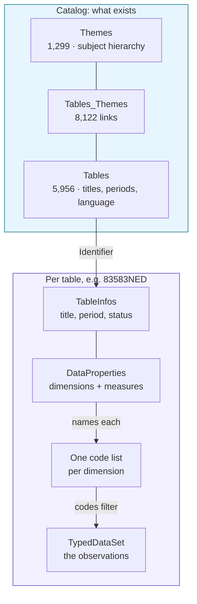

<div align="center">

# Statline MCP

**MCP server made for Dutch official statistics, queryable by any language model.**

An [MCP](https://modelcontextprotocol.io) server over CBS StatLine, the open data platform
of Statistics Netherlands. It turns a plain question into a real, citable statistic: find
the right table, read its structure, resolve the codes, return the numbers.

[](https://www.python.org/)
[](https://gofastmcp.com)
[](https://modelcontextprotocol.io)
[](LICENSE)
[](https://creativecommons.org/licenses/by/4.0/)


**5,956 tables · 4.1 billion observations · Dutch and English**

</div>

---

## Contents

1. [What it does](#what-it-does)
2. [Tools](#tools)
3. [Architecture](#architecture)
4. [How to use it: the two connections](#how-to-use-it-the-two-connections)
5. [A question, end to end](#a-question-end-to-end)
6. [The StatLine data model](#the-statline-data-model)
7. [StatLine architecture](#statline-architecture)
8. [Themes and the taxonomy](#themes-and-the-taxonomy)
9. [Deployment](#deployment)
10. [Performance](#performance)
11. [Languages and stack](#languages-and-stack)
12. [Configuration](#configuration)
13. [Licensing](#licensing)

---

## What it does

StatLine holds nearly 6,000 statistical tables, but they are addressed by opaque codes.
`83583NED` is a table, `2023JJ00` is the year 2023, `T001098` is a total, `GM0363` is
Amsterdam. No model can guess these. Statline MCP gives a model typed tools to discover
tables, look codes up, and query observations, so every figure it reports is traceable to a
named table rather than invented.

## Tools

| Tool | Purpose |
| --- | --- |
| `search_tables` | Find tables by keyword, ranked best-first, in Dutch or English (`language`). |
| `browse_themes` | Find tables by topic through the subject taxonomy. Full English tree. |
| `get_table_info` | A table's dimensions (what you filter on) and measures (the numbers). |
| `get_dimension_codes` | The valid codes of one dimension, with `search` to narrow big ones. |
| `get_data` | Filtered observations, with codes resolved to readable labels. |

Every response ends with a `Next:` line naming the tool to call next, so the chain is
self-guiding.

### Search is ranked, not filtered

The upstream catalog filter is literal substring matching joined with AND, so every word
has to appear verbatim or you get nothing at all. `"bevolking groei"` returns **zero**
tables that way, while 337 contain one of the two words. Dutch makes this worse: the word
you want is often glued inside a longer compound, so someone searching `bevolking` should
still find *Bevolkingsontwikkeling*.

So this server holds the catalog (5,956 rows, about 6 MB) and scores against it instead:

| Signal | Weight |
| --- | --- |
| Exact word in the title | 10 |
| Stem or compound match in the title | 6 |
| Substring of the title | 4 |
| In the short title | 2 |
| In the description | 1 |
| Whole query, in order, in the title | +15 |

Covering more of the query beats scoring highly on one word, so the coverage fraction is
squared into the score. Recency and table size act only as tie-breakers. When nothing
matches every word the results still come back, ordered, with the response saying so
plainly, rather than a model reading the best of a weak set as though it were exact.

```
search_tables("bevolking groei")
  -> 70870NED  Prognose bevolking; intervallen bevolkingsontwikkeling
     03759ned  Bevolking op 1 januari en gemiddeld; geslacht, leeftijd en regio
```

### Dutch prompts

StatLine is a Dutch source: every code label, and the wider half of the catalog, is in
Dutch. The server therefore ships MCP prompts in Dutch, which a client can offer as
ready-made starting points:

| Prompt | Doel |
| --- | --- |
| `statistiek_vraag(vraag)` | Beantwoord een vraag volgens de vaste werkwijze. |
| `tabel_verkennen(tabel_id)` | Vat samen wat er in een tabel zit. |
| `regio_vergelijken(onderwerp, regios, periode)` | Vergelijk gemeenten of provincies. |
| `tijdreeks(onderwerp, van_jaar, tot_jaar)` | Toon de ontwikkeling door de tijd. |

Each one states the method as well as the question, because the failure mode is not a
model that cannot call the tools, but one that guesses a code instead of looking it up.

For the open-LLM client, `prompts/system_nl.md` and `prompts/system_en.md` are complete
system prompts in either language:

```bash
python examples/open_llm_client.py --system-prompt prompts/system_nl.md --chat
```

## Architecture

Two hops and two protocols:

| Hop | From | To | Protocol |
| --- | --- | --- | --- |
| 1 | Your language model, via an MCP client | Statline MCP | MCP, over stdio or Streamable HTTP |
| 2 | Statline MCP | StatLine open data | HTTPS, OData |

`server.py` publishes the five typed tools, the Dutch prompts, and the `/health` and
`/metrics` routes. `cbs.py` holds the async OData client, the caches and the timing
instrumentation, and carries no MCP dependency, so it is usable on its own. Everything is
read-only.

## How to use it: the two connections

Using Statline MCP means wiring up two links. Get both right and any tool-calling model can
query Dutch statistics.

### Connection 1: the Statline MCP server

Pick one of these. The server is identical in each case, only the transport differs.

1. **Local subprocess (stdio)**, simplest for desktop use:

   ```bash
   pip install -r requirements.txt
   fastmcp run server.py
   ```

2. **Local HTTP**, when a client needs a URL:

   ```bash
   python server.py          # http://localhost:8000/mcp   (override with PORT)
   ```

3. **Hosted**, a URL anyone on your team can point at:

   ```
   https://<your-server>.fastmcp.app/mcp        # FastMCP Cloud
   https://statline-mcp.<your-cluster>/mcp      # your own Kubernetes
   ```

   See [Deployment](#deployment) for both.

Confirm any running server with:

```bash
python scripts/health_check.py --url http://localhost:8000/mcp
```

### Connection 2: your language model

1. **Claude Code, local server:**

   ```bash
   claude mcp add statline -- fastmcp run /absolute/path/to/Statline_MCP/server.py
   ```

2. **Claude Code, hosted server:**

   ```bash
   claude mcp add --transport http statline https://<your-server>.fastmcp.app/mcp
   ```

   If the server has authentication enabled it answers `401` until you sign in. Run `/mcp`
   inside an interactive Claude Code session and complete the browser flow. For CI or a
   non-interactive agent, pass a token instead:

   ```bash
   claude mcp add --transport http statline https://<your-server>.fastmcp.app/mcp \
     --header "Authorization: Bearer $TOKEN"
   ```

   Verify with `claude mcp list`, where you want `✔ Connected`.

3. **An open-weights model** (Qwen, Llama, Mistral, DeepSeek) behind vLLM, Ollama,
   llama.cpp, TGI or SGLang. An MCP tool's `inputSchema` is already valid JSON Schema, so it
   drops straight into an OpenAI `function.parameters` block:

   ```python
   def to_openai_tools(mcp_tools):
       return [{"type": "function",
                "function": {"name": t.name,
                             "description": t.description or "",
                             "parameters": t.inputSchema}}
               for t in mcp_tools]
   ```

   [`examples/open_llm_client.py`](examples/open_llm_client.py) is a complete working loop:

   ```bash
   # prove the wiring with no model at all
   python examples/open_llm_client.py --dry-run

   # interactive session: follow-up questions keep their context
   python examples/open_llm_client.py --chat --model MODEL-ID

   # a self-hosted model against a deployed server
   python examples/open_llm_client.py \
     --mcp https://statline-mcp.example.k8s.nl/mcp \
     --api-base http://localhost:8000/v1 \
     --model Qwen/Qwen3-32B-Instruct \
     "How many births were registered in 2023?"
   ```

4. **Any other MCP client**, such as LangChain, LlamaIndex, Cursor or Continue, connects to
   the same URL with no bridge at all.

### Driving it from a smaller model

Four things matter:

1. **Keep tool descriptions verbatim.** They carry the operational knowledge: codes are
   opaque, Dutch has wider coverage, use `browse_themes` when search fails. Truncating them
   to save context is what makes a model start inventing table identifiers.
2. **Return tool errors as text, not exceptions.** Error messages name the valid dimensions
   and measures, so a model that guessed wrong can correct itself on the next turn.
3. **Pin a system prompt against fabrication.** Require every figure to come from a tool
   result, and require the table identifier to be stated.
4. **Cap the loop** so a model that never commits to an answer cannot spin forever.

## A question, end to end

> **"How many employee jobs were there in Dutch manufacturing in December 2023?"**

1. **Find the table.** The keywords become a catalog query. Every word must appear in a
   title or description, so three words narrow hard.

   ```
   search_tables(query="banen werknemers bedrijfsgrootte", language="nl")
     -> 83583NED  Banen van werknemers; bedrijfsgrootte en economische activiteit
        period 2010-2024 · yearly · 11,160 rows
   ```

2. **Read its structure.**

   ```
   get_table_info(table_id="83583NED")
     dimensions: BedrijfstakkenBranchesSBI2008, Bedrijfsgrootte, Perioden
     measures:   BanenVanWerknemersInDecember_1  [x 1 000]
   ```

3. **Resolve the codes.** "Manufacturing" and "December 2023" are words, but the table wants
   codes.

   ```
   get_dimension_codes(table_id="83583NED",
                       dimension="BedrijfstakkenBranchesSBI2008", search="industrie")
     -> 307500  "C Industrie"
   ```

4. **Query.**

   ```
   get_data(table_id="83583NED",
            filters={"Perioden": ["2023JJ00"],
                     "BedrijfstakkenBranchesSBI2008": ["307500"],
                     "Bedrijfsgrootte": ["T001098"]})
   ```

   | Bedrijfstakken… | …_label | Bedrijfsgrootte | …_label | Perioden | …_label | BanenVanWerknemers… |
   | --- | --- | --- | --- | --- | --- | --- |
   | 307500 | C Industrie | T001098 | Totaal | 2023JJ00 | 2023 december | 793.3 |

**The answer:** roughly **793,300 employee jobs** in Dutch manufacturing in December 2023,
since the measure's unit is *x 1 000*, from table `83583NED`.

Each step's output is the next step's input, and codes are always looked up rather than
guessed. That is the whole design: the model never has to invent an identifier, so its
answer stays traceable.

## The StatLine data model

A table is a hypercube stored long-format. Four terms cover everything:

| Term | What it is | Example |
| --- | --- | --- |
| **Table** | One dataset, identified by a code | `83583NED` |
| **Dimension** | An axis you filter on | `Perioden`, `Bedrijfsgrootte` |
| **Code** | One allowed value of a dimension | `2023JJ00`, `307500` |
| **Measure** | A column holding actual numbers, with a unit | `BanenVanWerknemersInDecember_1` |

One observation carries a code per dimension and a value per measure:

```json
{ "BedrijfstakkenBranchesSBI2008": "307500",
  "Bedrijfsgrootte": "T001098",
  "Perioden": "2023JJ00",
  "BanenVanWerknemersInDecember_1": 793.3 }
```

Columns are typed. Dimensions come as `Dimension`, `TimeDimension` (usually `Perioden`), or
`GeoDimension` and `GeoDetail` for geography. Measures come as `Topic`, each with a `Unit`
and `Decimals`. A `TopicGroup` is only a heading, never a column.

**Scale**

| | Count |
| --- | --- |
| Tables | 5,956 |
| Observations across all tables | 4,108,824,238 |
| Theme nodes | 1,299 |
| Table to theme links | 8,122 |

**Two languages.** The catalog is bilingual but lopsided: 4,889 Dutch tables and 1,067
English, the English set being a translated subset with identifiers ending `ENG`. A table
exists in one language only, and its title, dimension names and code labels all follow it.
Both discovery tools therefore take `language`. Dutch gives far wider coverage, English
needs no translation.

## StatLine architecture

StatLine is exposed as OData. A catalog describes what exists, and per-table endpoints
describe and hold each dataset.



| Resource | Contents |
| --- | --- |
| `Tables` | Every table, with 26 metadata fields |
| `Themes` | The subject hierarchy, 1,299 nodes |
| `Tables_Themes` | 8,122 links joining themes to tables |
| `TableInfos` | Title, period, frequency, language, status, source |
| `DataProperties` | The table's dimensions and measures |
| `{DimensionName}` | That dimension's code list |
| `TypedDataSet` | The observations, numbers typed |

Discovery flows top to bottom. The catalog yields an identifier, `DataProperties` names the
dimensions, each dimension names its codes, and the codes filter the dataset. The five tools
map one to one onto that path:

1. `search_tables` and `browse_themes` query the catalog and the taxonomy.
2. `get_table_info` reads `TableInfos` and `DataProperties`.
3. `get_dimension_codes` reads one dimension's code list.
4. `get_data` filters `TypedDataSet` and joins the code lists back in as labels.

## Themes and the taxonomy

CBS classifies its tables in the subject hierarchy behind the StatLine website's navigation,
published as data so `browse_themes` can walk it.

It is two parallel trees, not one translated tree:

| | Theme nodes | Leads to |
| --- | --- | --- |
| Dutch (`nl`) | 1,060 | Dutch tables |
| English (`en`) | 239 | English (`ENG`) tables |

Structure is expressed purely by `ParentID`, so the tree is rebuilt client-side. All 1,299
nodes arrive in one request, so the server fetches them once, caches them for the process
behind an `asyncio.Lock`, and computes paths in memory. A resolved path:

```
Arbeid en sociale zekerheid > Arbeid en arbeidsmarkt > Banen, vacatures, werkgelegenheid > Banen
  -> 83583NED, 83582NED, 86205NED, 84826NED, …
```

Tables sit on leaves, so browsing means descending: a parent theme usually lists sub-themes
and no tables. 8,122 links across 5,956 tables means many tables are filed under several
themes.

### Why two discovery tools

They fail in opposite directions:

| | `search_tables` | `browse_themes` |
| --- | --- | --- |
| Finds | specifically named tables | topic areas |
| Needs | the right word, right language | only a rough topic |
| English reach | ~1,100 of 5,956 tables | full parallel tree |
| Fails when | your vocabulary is wrong | your term is too specific |

Searching themes for `"Births"` returns nothing, because that is a *table* name and not a
topic (`Population development` is the theme). Conversely an English question can navigate
the English tree to real data with nothing translated. When one route is empty the other is
the intended recovery, and the server's instructions say so.

## Deployment

### FastMCP Cloud

Builds from `requirements.txt`, entrypoint `server.py:mcp`, redeploys on every push to
`main`, and gives you `https://<name>.fastmcp.app/mcp`. Authentication is a per-server
toggle: turn it off for an open endpoint, or keep it and connect with OAuth as above.

### Docker

```bash
docker build -t statline-mcp .
docker run --rm -p 8000:8000 statline-mcp
```

Runs unprivileged (uid 10001) with a read-only root filesystem, and its `HEALTHCHECK`
completes a real MCP handshake rather than probing the port.

### Kubernetes

[`deploy/k8s/`](deploy/k8s) holds a Deployment, Service and Ingress for the
GitHub to registry to cluster pattern:

```bash
kubectl kustomize deploy/k8s | kubectl apply -f -
```

The server lands at `https://<host>/mcp`. Three things worth knowing:

1. **Probes hit `/health`, not `/mcp`.** A bare `GET /mcp` is not a valid protocol request,
   so an `httpGet` probe against it would never pass. `server.py` exposes a plain `200` at
   `/health` for exactly this.
2. **`/health` does not query upstream**, on purpose. A probe reports whether *this process*
   is serving, and a slow upstream should not restart your pods. Use
   `scripts/health_check.py` as a `startupProbe` for a deeper gate.
3. **Raise the ingress read timeout.** Streamable HTTP holds responses open, and a default
   60s cuts long tool calls off mid-stream. The manifest sets 300s and disables proxy
   buffering.

[`.github/workflows/release.yml`](.github/workflows/release.yml) builds and pushes the image
to GHCR on every push to `main`, then boots it and probes `/health` before calling the
release good.

## Performance

Metadata is cached, observations never are. A table's shape changes when the
table is revised, so a few hours of staleness is invisible; a figure is the
volatile part, and a stale figure is a wrong answer.

Measured with `scripts/benchmark.py` on one realistic four-call question:

| | Upstream requests | Wall clock |
| --- | --- | --- |
| Cold cache | 8 | ~1200 ms |
| Same chain, warm | 1 | ~35 ms |
| Follow-up question, same table | 1 | ~30 ms |
| Search, index prewarmed | 0 | ~10 ms |
| Search, repeat of the same query | 0 | ~0 ms |

The request counts are exact and reproducible; the wall-clock figures move with
network conditions, so treat them as indicative. The single warm request is the
observations themselves, which is the point: everything describing the table is
cached, and every number is fetched fresh.

Six caches are kept, each with hit, miss and eviction counters: table info, data
properties, code labels, code lists, themes and catalog searches. Each is an LRU
bounded at 128 entries as well as by its TTL, so a server asked about many
tables cannot grow without limit: one large code list is around 60 KB and the
theme tree is 666 KB, which adds up quickly when nothing is ever released.

Transient upstream failures are retried twice with exponential backoff and
jitter. Only faults a retry can fix are eligible, so a 404 fails immediately
rather than making a wrong argument slow as well as wrong, and a `Retry-After`
header is honoured when one is sent. The jitter matters because `get_data` fans
out: without it, several failed requests would wake together and hit a
recovering server as one burst.

The catalog index is built once at startup in the background, so nobody waits for it:
building it on demand would make the first search cost about 1.3 seconds, while a
prewarmed server answers in roughly 35 ms. Prewarming never blocks startup and never
fails a request, since search falls back to server-side filtering without an index. Set
`STATLINE_PREWARM=0` for short-lived processes that will only ask one question.

Ranking itself costs about 24 ms across all 5,956 rows, which is well under the network
round trip it replaces.

Two other things keep the critical path short:

1. `get_data` issues its label lookups **alongside** the observations request
   rather than after it, since labels depend only on dimension names. That takes
   a full round trip off a cold call.
2. One HTTP connection pool is shared for the process, so repeat calls skip TLS
   setup. On a cold start that handshake is the single largest cost.

### Seeing where time goes

```bash
python scripts/benchmark.py                  # cold vs warm, with a timing table
python scripts/benchmark.py --url <mcp-url>  # against a deployment
```

A running server also reports live figures at `/metrics`:

```json
{ "timings_ms": { "tool:get_data": { "count": 3, "mean_ms": 33.8, "max_ms": 43.9 },
                  "upstream":      { "count": 12, "mean_ms": 49.7 } },
  "caches":     { "data_properties": { "hits": 4, "misses": 1, "entries": 1 } } }
```

Timings come in two families: `tool:<name>` is what the caller waits for,
including validation and label joining, while a bare `<name>` is the client
function beneath it and `upstream` is a single HTTP request. A large gap between
`tool:get_data` and `upstream` means the time is being spent in this server
rather than the network.

Set `STATLINE_LOG_LEVEL=INFO` to log every tool call and upstream request with
its duration. Logs go to stderr, never stdout, because under the stdio transport
stdout carries the MCP protocol itself.

## Languages and stack

| Language | Lines | Used for |
| --- | --- | --- |
| **Python** | ~1,500 | The server, the OData client, tests, the open-LLM example |
| **YAML** | ~270 | Kubernetes manifests and GitHub Actions workflows |
| **Markdown** | ~460 | This documentation |
| **Dockerfile** | ~40 | Container image |
| **TOML** | 8 | Ruff lint configuration |

Python 3.10+, tested on 3.10, 3.12 and 3.13. Two runtime dependencies:

| Package | Role |
| --- | --- |
| [`fastmcp`](https://gofastmcp.com) ≥ 3.4 | MCP server framework, stdio and Streamable HTTP |
| [`httpx`](https://www.python-httpx.org/) ≥ 0.27 | Async HTTP with connection pooling |

Tooling: **ruff** for lint and formatting, **GitHub Actions** for CI, **Docker** and
**Kustomize** for deployment.

### Layout

| Path | Purpose |
| --- | --- |
| `server.py` | The five tools and `/health`. Entrypoint `server.py:mcp`. |
| `cbs.py` | Async StatLine client, with no MCP dependency, usable on its own. |
| `smoke.py` | End-to-end test against the live API, including caching and prompts. |
| `tests/test_unit.py` | Offline unit tests, no network required. |
| `scripts/health_check.py` | Probe a running server, shallow or deep. |
| `scripts/benchmark.py` | Cold vs warm timings, per operation. |
| `prompts/` | System prompts in Dutch and English. |
| `examples/open_llm_client.py` | Tool-calling loop for any OpenAI-compatible model. |
| `Dockerfile`, `deploy/k8s/` | Self-hosting. |
| `.github/workflows/` | `test.yml` (lint, smoke, container boot), `release.yml` (image). |

### Test coverage

Two suites, deliberately separated.

**`pytest` runs 73 offline unit tests in about 2 seconds**, with no network at all. They
cover filter construction and escaping, table-id validation, search ranking (compounds,
coverage, phrase boosts, language isolation), the cache (TTL expiry, LRU eviction, lock
pruning, concurrent misses collapsing to one fetch), the retry policy (backoff,
`Retry-After`, and 404 never being retried), the timing registry and the rendering
helpers. This is the suite that should gate a merge, because it fails only when
the code is wrong.

```bash
pip install -r requirements-dev.txt
pytest
```

**`smoke.py` drives the server through an in-memory client against the live API.** It
verifies real behaviour against real data, so it needs network access and will fail if the
upstream service is down or an outbound proxy intercepts TLS. It tells you about the world
rather than about your change.

```
$ python smoke.py
tools: browse_themes, get_data, get_dimension_codes, get_table_info, search_tables
...
ALL PASS
```

**60 checks across 11 areas:**

| Area | Checks | What is asserted |
| --- | --- | --- |
| `search_tables` | 7 | Dutch and English filtering, `ENG` identifiers, cross-language containment, empty-result guidance |
| `browse_themes` | 11 | Both language trees, paths, descent to tables, an English topic reaching real data |
| `get_data` | 12 | Paging boundaries, label placement, code trimming, measure selection, padded-code matching |
| `get_dimension_codes` | 6 | Narrowing, and place-name aliases resolving to official spellings |
| `get_table_info` | 3 | Dimensions, measures, time dimension present |
| Caching | 7 | Warm run costs one request, and that request is the dataset, never metadata |
| Dutch prompts | 5 | All four registered, rendered in Dutch, naming the tools and the period format |
| Error handling | 4 | Bad table, unknown dimension, unknown measure, empty result is not an error |
| Timings | 3 | Per-tool, per-function and upstream timings all recorded |
| Validation | 1 | Argument bounds enforced |
| Registration | 1 | Exactly five tools exposed |
| Caching (unit) | 8 | LRU eviction, TTL expiry, lock pruning, concurrent-miss collapsing |
| Ranking (unit) | 16 | Compound matching, coverage, phrases, language isolation |

Several of these exist because they caught real bugs: codes are stored space-padded, so an
exact-match filter silently returned nothing for short codes; `$skip` is unsupported on one
of the two upstream endpoints, so paging broke past the first page; and the row count
returned for a filtered query is not the count of matching rows.

### Development

```bash
pytest                                   # 73 offline unit tests, ~2s
python smoke.py                          # 60 end-to-end checks against the live API
python scripts/benchmark.py              # cold vs warm timings
ruff check . && ruff format --check .    # lint
```

CI runs on push, on pull request, and weekly. The weekly run catches upstream changes before
a user does.

## Configuration

| Variable | Default | Purpose |
| --- | --- | --- |
| `PORT` | `8000` | Port for the HTTP transport. |
| `STATLINE_CACHE_TTL` | `21600` (6h) | Lifetime of cached metadata. `0` disables caching. |
| `STATLINE_SEARCH_TTL` | `300` (5m) | Lifetime of cached catalog searches. `0` disables. |
| `STATLINE_CACHE_MAXSIZE` | `128` | Entries kept per cache before the least recently used is evicted. |
| `STATLINE_RETRIES` | `2` | Extra attempts after a transient upstream failure. `0` disables. |
| `STATLINE_RETRY_DELAY` | `0.25` | Base seconds for exponential backoff between retries. |
| `STATLINE_PREWARM` | `1` | Build the catalog index at startup. `0` builds it on first search. |
| `STATLINE_LOG_LEVEL` | `WARNING` | `INFO` logs every tool call and upstream request; `DEBUG` adds per-function timings. |
| `STATLINE_USER_AGENT` | `statline-mcp/0.3 (+this repo)` | How your traffic identifies itself upstream. |
| `MCP_STATLINE_URL` | `http://127.0.0.1:8000/mcp` | Default endpoint for the scripts. |
| `MCP_STATLINE_TOKEN` | none | Bearer token for `health_check.py` against a protected server. |
| `STATLINE_CA_BUNDLE` | none | CA bundle to validate upstream TLS against. Also reads `SSL_CERT_FILE` and `REQUESTS_CA_BUNDLE`. |
| `HTTPS_PROXY` / `NO_PROXY` | none | Standard proxy variables, honoured automatically. |

### Behind a corporate proxy

On a network that routes outbound traffic through an intercepting proxy, two
things are needed. First, point the proxy variables at it while exempting anything
internal:

```bash
export HTTPS_PROXY=http://proxy.example:8080
export NO_PROXY=127.0.0.1,localhost,.internal.example
```

Second, if that proxy terminates and re-signs TLS, the certificate presented for
`opendata.cbs.nl` is the proxy's rather than the real one, and the default trust store
rejects it. Point the server at your organisation's CA bundle:

```bash
export STATLINE_CA_BUNDLE=/path/to/ca-bundle.crt
```

Certificate verification is never disabled, only redirected to a different trust anchor.
Set these in the terminal that runs the server, since that is the process making the
outbound calls, and restart it afterwards.

**If you fork or self-host, set `STATLINE_USER_AGENT`.** Every upstream request carries this
header so the data provider can see who is calling and has a contact point. Left at the
default, your deployment's traffic is attributed to this repository rather than to you, and
any rate limit ever applied to that identifier would follow you with it. Give it your own
name and an address someone could reach you at:

```bash
export STATLINE_USER_AGENT="acme-stats/1.0 (+https://acme.example/contact)"
```

## Licensing

**Code** is [MIT](LICENSE). Use it, fork it, ship it commercially, and keep the copyright
notice.

**Data** retrieved through this server is © Statistics Netherlands (CBS) and published under
[CC BY 4.0](https://creativecommons.org/licenses/by/4.0/). You may reuse it freely,
including commercially, provided you **attribute Statistics Netherlands**.

If you publish figures obtained through Statline MCP, credit them like this:

> Source: Statistics Netherlands (CBS), StatLine table `83583NED`, retrieved 2026-08-31.
> Licensed under CC BY 4.0.

Citing the table identifier and the retrieval date matters, because StatLine tables are
revised and figures are marked provisional or final. The identifier makes any number
reproducible.

This project is independent, and is not endorsed by or affiliated with Statistics
Netherlands.

## Author

Built by [@athithyai](https://github.com/athithyai). Contributions welcome, so open an issue
or a pull request.
