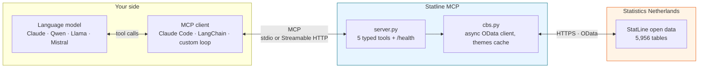
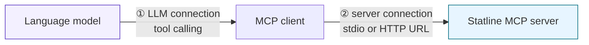
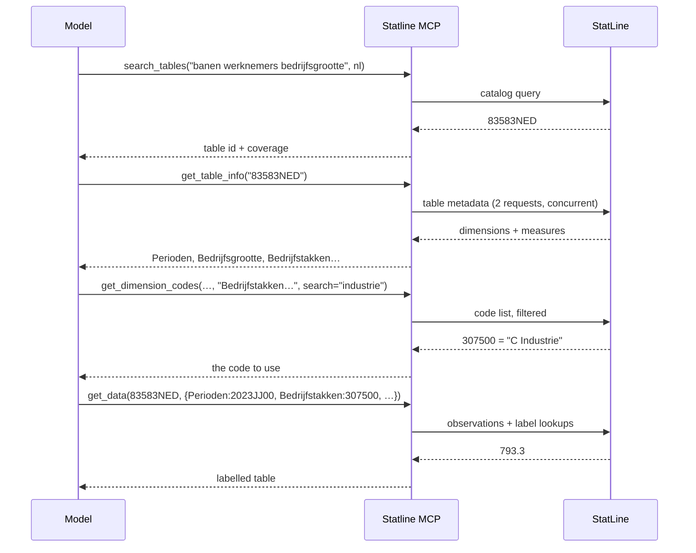
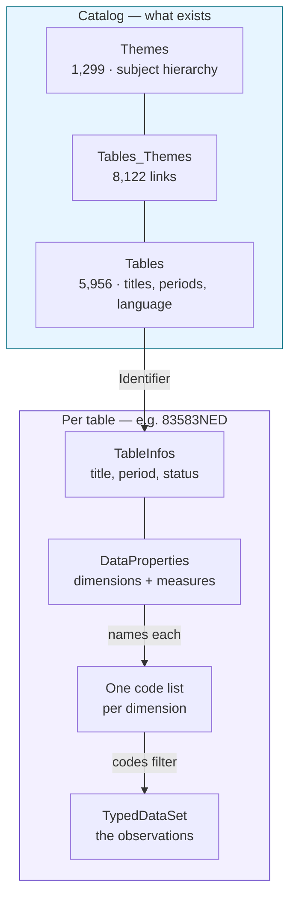

<div align="center">

# Statline MCP

**Dutch official statistics, queryable by any language model.**

An [MCP](https://modelcontextprotocol.io) server over **CBS StatLine** — the open data
platform of Statistics Netherlands. It turns a plain question into a real, citable
statistic: find the right table, read its structure, resolve the codes, return the numbers.

[](https://www.python.org/)
[](https://gofastmcp.com)
[](https://modelcontextprotocol.io)
[](LICENSE)
[](https://creativecommons.org/licenses/by/4.0/)

**5,956 tables · 4.1 billion observations · Dutch and English · no API key**

</div>

---

## Contents

- [What it does](#what-it-does) · [Tools](#tools)
- [Architecture](#architecture)
- [How to use it: the two connections](#how-to-use-it-the-two-connections)
  - [Connection 1 — the Statline MCP server](#connection-1--the-statline-mcp-server)
  - [Connection 2 — your language model](#connection-2--your-language-model)
- [A question, end to end](#a-question-end-to-end)
- [The StatLine data model](#the-statline-data-model)
- [StatLine architecture](#statline-architecture)
- [Themes and the taxonomy](#themes-and-the-taxonomy)
- [Deployment](#deployment) · [Languages and stack](#languages-and-stack) · [Licensing](#licensing)

---

## What it does

StatLine holds nearly 6,000 statistical tables, but they are addressed by opaque codes —
`83583NED` is a table, `2023JJ00` is the year 2023, `T001098` is a total, `GM0363` is
Amsterdam. No model can guess these. Statline MCP gives a model a set of typed tools to
discover tables, look codes up, and query observations, so that every figure it reports is
traceable to a named table rather than invented.

## Tools

| Tool | Purpose |
| --- | --- |
| `search_tables` | Find tables by keyword, in Dutch or English (`language`). |
| `browse_themes` | Find tables by topic through the subject taxonomy. Full English tree. |
| `get_table_info` | A table's dimensions (what you filter on) and measures (the numbers). |
| `get_dimension_codes` | The valid codes of one dimension, with `search` to narrow big ones. |
| `get_data` | Filtered observations, with codes resolved to readable labels. |

Every response ends with a `Next:` line naming the tool to call next, so the chain is
self-guiding.

## Architecture



Two hops, two protocols. Your model talks **MCP** to this server; this server talks
**OData** to StatLine. Everything is read-only and needs no credentials.

## How to use it: the two connections

Using Statline MCP means wiring up two links. Get both right and any tool-calling model can
query Dutch statistics.



### Connection 1 — the Statline MCP server

Pick **one** of these. The server is the same in each case; only the transport differs.

**Local subprocess (stdio)** — simplest for desktop use:

```bash
pip install -r requirements.txt
fastmcp run server.py
```

**Local HTTP** — when a client needs a URL:

```bash
python server.py          # http://localhost:8000/mcp   (override with PORT)
```

**Hosted** — a URL anyone on your team can point at:

```
https://<your-server>.fastmcp.app/mcp        # FastMCP Cloud
https://statline-mcp.<your-cluster>/mcp      # your own Kubernetes
```

See [Deployment](#deployment) for both. Confirm any running server with:

```bash
python scripts/health_check.py --url http://localhost:8000/mcp
```

### Connection 2 — your language model

**Claude Code, local server:**

```bash
claude mcp add statline -- fastmcp run /absolute/path/to/Statline_MCP/server.py
```

**Claude Code, hosted server:**

```bash
claude mcp add --transport http statline https://<your-server>.fastmcp.app/mcp
```

If the server has authentication enabled it answers `401` until you sign in — run `/mcp`
inside an interactive Claude Code session and complete the browser flow. For CI or a
non-interactive agent, pass a token instead:

```bash
claude mcp add --transport http statline https://<your-server>.fastmcp.app/mcp \
  --header "Authorization: Bearer $TOKEN"
```

Verify with `claude mcp list` — you want `✔ Connected`.

**An open-weights model** (Qwen, Llama, Mistral, DeepSeek) behind vLLM, Ollama,
llama.cpp, TGI or SGLang. An MCP tool's `inputSchema` is already valid JSON Schema, so it
drops straight into an OpenAI `function.parameters` block:

```python
def to_openai_tools(mcp_tools):
    return [{"type": "function",
             "function": {"name": t.name,
                          "description": t.description or "",
                          "parameters": t.inputSchema}}
            for t in mcp_tools]
```

[`examples/open_llm_client.py`](examples/open_llm_client.py) is a complete working loop:

```bash
# prove the wiring with no model at all
python examples/open_llm_client.py --dry-run

# a self-hosted model against a deployed server
python examples/open_llm_client.py \
  --mcp https://statline-mcp.example.k8s.nl/mcp \
  --api-base http://localhost:8000/v1 \
  --model Qwen/Qwen3-32B-Instruct \
  "How many births were registered in 2023?"
```

Four things matter with smaller models:

1. **Keep tool descriptions verbatim.** They carry the operational knowledge — codes are
   opaque, Dutch has wider coverage, use `browse_themes` when search fails. Truncating them
   to save context is what makes a model start inventing table identifiers.
2. **Return tool errors as text, not exceptions.** Error messages name the valid dimensions
   and measures, so a model that guessed wrong can correct itself next turn.
3. **Pin a system prompt against fabrication.** Require every figure to come from a tool
   result, and require the table id to be stated.
4. **Cap the loop** so a model that never commits cannot spin forever.

Any other MCP client — LangChain, LlamaIndex, Cursor, Continue — connects to the same URL
with no bridge at all.

## A question, end to end

> **"How many employee jobs were there in Dutch manufacturing in December 2023?"**



**Step 1 — find the table.** The keywords become a catalog query. Each word must appear in
a title or description, so three words narrow hard:

```
search_tables(query="banen werknemers bedrijfsgrootte", language="nl")
  -> 83583NED  Banen van werknemers; bedrijfsgrootte en economische activiteit
     period 2010-2024 · yearly · 11,160 rows
```

**Step 2 — read its structure.**

```
get_table_info(table_id="83583NED")
  dimensions: BedrijfstakkenBranchesSBI2008, Bedrijfsgrootte, Perioden
  measures:   BanenVanWerknemersInDecember_1  [x 1 000]
```

**Step 3 — resolve the codes.** "Manufacturing" and "December 2023" are words; the table
wants codes:

```
get_dimension_codes(table_id="83583NED",
                    dimension="BedrijfstakkenBranchesSBI2008", search="industrie")
  -> 307500  "C Industrie"
```

**Step 4 — query.**

```
get_data(table_id="83583NED",
         filters={"Perioden": ["2023JJ00"],
                  "BedrijfstakkenBranchesSBI2008": ["307500"],
                  "Bedrijfsgrootte": ["T001098"]})
```

| Bedrijfstakken… | …_label | Bedrijfsgrootte | …_label | Perioden | …_label | BanenVanWerknemers… |
| --- | --- | --- | --- | --- | --- | --- |
| 307500 | C Industrie | T001098 | Totaal | 2023JJ00 | 2023 december | 793.3 |

**The answer:** roughly **793,300 employee jobs** in Dutch manufacturing in December 2023 —
the measure's unit is *x 1 000* — from table `83583NED`.

Each step's output is the next step's input, and codes are always looked up rather than
guessed. That is the whole design: the model never has to invent an identifier, so its
answer stays traceable.

## The StatLine data model

A table is a hypercube stored long-format. Four terms cover everything:

| Term | What it is | Example |
| --- | --- | --- |
| **Table** | One dataset, identified by a code | `83583NED` |
| **Dimension** | An axis you filter on | `Perioden`, `Bedrijfsgrootte` |
| **Code** | One allowed value of a dimension | `2023JJ00`, `307500` |
| **Measure** | A column holding actual numbers, with a unit | `BanenVanWerknemersInDecember_1` |

One observation carries a code per dimension and a value per measure:

```json
{ "BedrijfstakkenBranchesSBI2008": "307500",
  "Bedrijfsgrootte": "T001098",
  "Perioden": "2023JJ00",
  "BanenVanWerknemersInDecember_1": 793.3 }
```

Columns are typed. Dimensions come as `Dimension`, `TimeDimension` (usually `Perioden`), or
`GeoDimension` / `GeoDetail` for geography; measures come as `Topic`, each with a `Unit` and
`Decimals`. `TopicGroup` is only a heading, never a column.

**Scale**

| | Count |
| --- | --- |
| Tables | 5,956 |
| Observations across all tables | 4,108,824,238 |
| Theme nodes | 1,299 |
| Table ↔ theme links | 8,122 |

**Two languages.** The catalog is bilingual but lopsided — **4,889 Dutch tables and 1,067
English**, the English set a translated subset with identifiers ending `ENG`. A table exists
in one language only: title, dimension names and code labels all follow it. Both discovery
tools therefore take `language`. Dutch gives far wider coverage; English needs no
translation.

## StatLine architecture

StatLine is exposed as OData. There is a catalog describing what exists, and per-table
endpoints describing and holding each dataset.



| Resource | Contents |
| --- | --- |
| `Tables` | Every table with 26 metadata fields |
| `Themes` / `Tables_Themes` | The subject taxonomy and its links to tables |
| `TableInfos` | Title, period, frequency, language, status, source |
| `DataProperties` | The table's dimensions and measures |
| `{DimensionName}` | That dimension's code list |
| `TypedDataSet` | Observations, numbers typed |

Discovery flows top to bottom: the catalog yields an identifier, `DataProperties` names the
dimensions, each dimension names its codes, and the codes filter the dataset. The five tools
map one-to-one onto that path.

## Themes and the taxonomy

CBS classifies its tables in the subject hierarchy behind the StatLine website's navigation
— published as data, so `browse_themes` can walk it.

It is **two parallel trees**, not one translated tree:

| | Theme nodes | Leads to |
| --- | --- | --- |
| Dutch (`nl`) | 1,060 | Dutch tables |
| English (`en`) | 239 | English (`ENG`) tables |

Structure is expressed purely by `ParentID`, so the tree is rebuilt client-side. All 1,299
nodes arrive in one request, so the server fetches them once, caches them for the process
behind an `asyncio.Lock`, and computes paths in memory. A resolved path:

```
Arbeid en sociale zekerheid > Arbeid en arbeidsmarkt > Banen, vacatures, werkgelegenheid > Banen
  -> 83583NED, 83582NED, 86205NED, 84826NED, …
```

**Tables sit on leaves**, so browsing means descending — a parent theme usually lists
sub-themes and no tables. 8,122 links across 5,956 tables means many tables are filed under
several themes.

### Why two discovery tools

They fail in opposite directions:

| | `search_tables` | `browse_themes` |
| --- | --- | --- |
| Finds | specifically named tables | topic areas |
| Needs | the right word, right language | only a rough topic |
| English reach | ~1,100 of 5,956 tables | full parallel tree |
| Fails when | your vocabulary is wrong | your term is too specific |

Searching themes for `"Births"` returns nothing — that is a *table* name, not a topic
(`Population development` is the theme). Conversely an English question can navigate the
English tree to real data with nothing translated. When one route is empty, the other is
the intended recovery, and the server's instructions say so.

## Deployment

### FastMCP Cloud

Builds from `requirements.txt`, entrypoint **`server.py:mcp`**, redeploys on every push to
`main`. Gives you `https://<name>.fastmcp.app/mcp`. Authentication is a per-server toggle —
turn it off for an open endpoint, or keep it and connect with OAuth as above.

### Docker

```bash
docker build -t statline-mcp .
docker run --rm -p 8000:8000 statline-mcp
```

Unprivileged (uid 10001), read-only root filesystem, and a `HEALTHCHECK` that completes a
real MCP handshake rather than probing the port.

### Kubernetes

[`deploy/k8s/`](deploy/k8s) holds a Deployment, Service and Ingress for the
GitHub → registry → cluster pattern:

```bash
kubectl kustomize deploy/k8s | kubectl apply -f -
```

The server lands at `https://<host>/mcp`. Three things worth knowing:

- **Probes hit `/health`, not `/mcp`.** A bare `GET /mcp` is not a valid protocol request,
  so an `httpGet` probe against it would never pass. `server.py` exposes a plain `200` at
  `/health` for exactly this.
- **`/health` does not query upstream** on purpose: a probe reports whether *this process*
  is serving, and a slow upstream should not restart your pods. Use
  `scripts/health_check.py` as a `startupProbe` for a deeper gate.
- **Raise the ingress read timeout.** Streamable HTTP holds responses open; a default 60s
  cuts long tool calls off mid-stream. The manifest sets 300s and disables proxy buffering.

[`.github/workflows/release.yml`](.github/workflows/release.yml) builds and pushes the image
to GHCR on every push to `main`, then boots it and probes `/health` before calling the
release good.

## Languages and stack

| Language | Lines | Used for |
| --- | --- | --- |
| **Python** | ~1,500 | The server, the OData client, tests, the open-LLM example |
| **YAML** | ~270 | Kubernetes manifests and GitHub Actions workflows |
| **Markdown** | ~460 | This documentation |
| **Dockerfile** | ~40 | Container image |
| **TOML** | 8 | Ruff lint configuration |

Python 3.10+, tested on 3.10, 3.12 and 3.13. Two runtime dependencies:

| Package | Role |
| --- | --- |
| [`fastmcp`](https://gofastmcp.com) ≥ 3.4 | MCP server framework, stdio and Streamable HTTP |
| [`httpx`](https://www.python-httpx.org/) ≥ 0.27 | Async HTTP with connection pooling |

Tooling: **ruff** for lint and formatting, **GitHub Actions** for CI, **Docker** and
**Kustomize** for deployment.

### Layout

| Path | Purpose |
| --- | --- |
| `server.py` | The five tools and `/health`. Entrypoint `server.py:mcp`. |
| `cbs.py` | Async StatLine client. No MCP dependency — usable on its own. |
| `smoke.py` | 41-check end-to-end test against the live API. |
| `scripts/health_check.py` | Probe a running server, shallow or deep. |
| `examples/open_llm_client.py` | Tool-calling loop for any OpenAI-compatible model. |
| `Dockerfile` · `deploy/k8s/` | Self-hosting. |
| `.github/workflows/` | `test.yml` (lint, smoke, container boot), `release.yml` (image). |

### Configuration

| Variable | Default | Purpose |
| --- | --- | --- |
| `PORT` | `8000` | Port for the HTTP transport. |
| `STATLINE_USER_AGENT` | `statline-mcp/0.3 (+this repo)` | How your traffic identifies itself upstream. |
| `MCP_STATLINE_URL` | `http://127.0.0.1:8000/mcp` | Default endpoint for the scripts. |
| `MCP_STATLINE_TOKEN` | — | Bearer token for `health_check.py` against a protected server. |

**If you fork or self-host, set `STATLINE_USER_AGENT`.** Every upstream request carries this
header so the data provider can see who is calling and has a contact point. Left at the
default, your deployment's traffic is attributed to this repository rather than to you — and
any rate limit ever applied to that identifier would follow you with it. Give it your own
name and a URL or address someone could reach you at:

```bash
export STATLINE_USER_AGENT="acme-stats/1.0 (+https://acme.example/contact)"
```

### Development

```bash
python smoke.py                          # end-to-end against the live API
ruff check . && ruff format --check .    # lint
```

CI runs on push, on pull request, and weekly — the weekly run catches upstream changes
before a user does.

## Licensing

**Code** — [MIT](LICENSE). Use it, fork it, ship it commercially; keep the copyright notice.

**Data** — the statistics this server retrieves are © Statistics Netherlands (CBS) and
published under [CC BY 4.0](https://creativecommons.org/licenses/by/4.0/). You may reuse
them freely, including commercially, provided you **attribute Statistics Netherlands**.

If you publish figures obtained through Statline MCP, credit them like this:

> Source: Statistics Netherlands (CBS), StatLine table `83583NED`, retrieved 2026-08-31.
> Licensed under CC BY 4.0.

Citing the table identifier and retrieval date matters: StatLine tables are revised, and
figures are marked provisional or final. The identifier makes any number reproducible.

This project is independent and not endorsed by or affiliated with Statistics Netherlands.

## Author

Built by [@athithyai](https://github.com/athithyai). Contributions welcome — open an issue
or a pull request.
